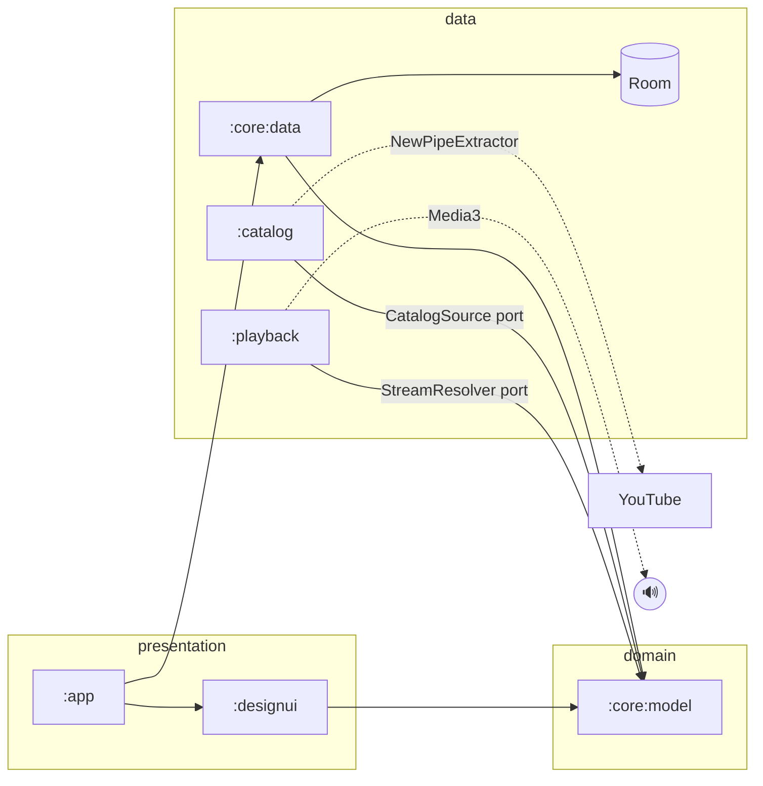
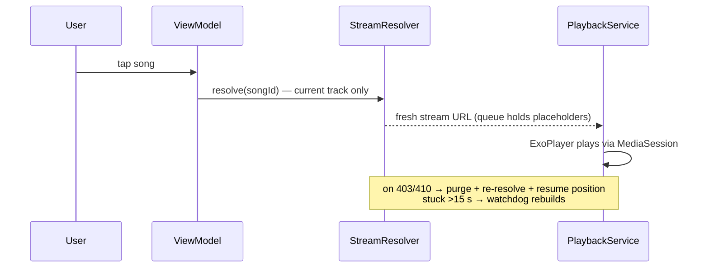

<div align="center">

# 🎵 Sway

### *Your music, in flow.*

An independent Android music client — Kotlin · Jetpack Compose · Material 3 Expressive<br/>
streaming from the YouTube Music catalogue, with a data layer you own.


</div>

---

## Why Sway

Big-platform music apps lock your library behind accounts and bury playback under upsells.
Sway takes the **reach of the YouTube Music catalogue** and pairs it with everything a player
should own itself:

| | |
|---|---|
| 🔍 **Discovery** | Search songs, albums, artists & playlists — no login, ever |
| ▶️ **Resilient playback** | Stream URLs validated at read time, renewed on failure, position always preserved |
| 🧭 **Queue you control** | Full queue semantics with shuffle/repeat and kill-proof session restore |
| ❤️ **Your library** | Likes, playlists and history live on-device — exportable, not hostage |
| 🎨 **Artwork-driven atmosphere** | Color extraction feeds smooth surfaces; motion benchmarked to iOS-grade fluidity |
| 💬 **Honest states** | Typed errors everywhere — loading, empty, offline, retry. Blank screens are forbidden |

## Design direction

> Smoothness is a feature, not garnish.

Sway builds on **Material 3 Expressive**, customized with its own token system —
violet-cast brand palette, Outfit + Inter typography, shape vocabulary with one radius step per
nesting level — and a hard **motion contract**: player transitions ≤ 300 ms, standard cubic +
spring curves, gesture-interruptible animations, zero blur in v1, reduced-motion honored.
Artwork drives atmosphere through tonal washes and computed scrims with WCAG-AA contrast guarantees.

Full spec: [`ux-design-specification.md`](_bmad-output/planning-artifacts/ux-design-specification.md)

## Architecture

Seven Gradle modules, dependencies pointing one direction only. Extraction stays behind our own
ports so transports can change without touching UI or repositories.





## Roadmap

15 epics · **62 stories** · 260 points, gated by a readiness check ([verdict: PASS](docs/research/sprint-R1-summary.md)).
Every story maps to exactly one completing requirement — 40 FRs and 10 NFRs, zero orphans.

| Epic | Focus | Pts | Status |
|---|---|---:|---|
| [E1](https://github.com/HemantKumar822/sway/milestone/4) — Workspace & Quality Gates | 7-module skeleton, Hilt graph, mechanical-law CI | 7 | 🔨 next |
| [E2](https://github.com/HemantKumar822/sway/milestone/2) — Domain Model & Ports | Pure-Kotlin vocabulary, `CatalogSource` / `StreamResolver` | 11 | ⏳ |
| [E3](https://github.com/HemantKumar822/sway/milestone/3) — Catalog Adapter | NewPipe behind ports: search, details, resolver | 25 | ⏳ |
| [E4](https://github.com/HemantKumar822/sway/milestone/5) — Playback Engine | One-song core loop through `MediaLibraryService` | 21 | ⏳ |
| [E5](https://github.com/HemantKumar822/sway/milestone/6) — Stream Resilience | Expiry defense layers, watchdog, quality pref | 16 | ⏳ |
| [E6](https://github.com/HemantKumar822/sway/milestone/7) — Background & System | Notification, lock screen, audio focus, routes | 11 | ⏳ |
| [E7](https://github.com/HemantKumar822/sway/milestone/8) — Queue & Session | Manipulation semantics, modes, restore after death | 16 | ⏳ |
| [E8](https://github.com/HemantKumar822/sway/milestone/9) — Owned Data Layer | Likes, playlists, history, offline fallback cache | 20 | ⏳ |
| [E9](https://github.com/HemantKumar822/sway/milestone/10) — Design Language & Nav Shell | Tokens, state kit, tabs, startup law | 24 | ⏳ |
| [E10](https://github.com/HemantKumar822/sway/milestone/11) — Discovery & Details | Search, pagination, album/artist/playlist screens | 30 | ⏳ |
| [E11](https://github.com/HemantKumar822/sway/milestone/12) — Library Surfaces | Liked, history, playlist editor, hub | 14 | ⏳ |
| [E12](https://github.com/HemantKumar822/sway/milestone/13) — Player Surfaces | Mini player, full player, queue sheet | 21 | ⏳ |
| [E13](https://github.com/HemantKumar822/sway/milestone/14) — Artwork & Atmosphere | Bounded caching, extraction/scrim engine | 10 | ⏳ |
| [E14](https://github.com/HemantKumar822/sway/milestone/15) — Honesty Pass | Offline e2e, soak tests, budget gates | 23 | ⏳ |
| [E15](https://github.com/HemantKumar822/sway/milestone/16) — Settings & Release | Theme, licenses, privacy audit, evidence pack | 11 | ⏳ |

Live progress: [milestones](https://github.com/HemantKumar822/sway/milestones) · [all issues](https://github.com/HemantKumar822/sway/issues)

## How this repo is built

This project runs an AI-assisted engineering pipeline with human sign-off at every gate:

```text
Study reference apps ──▶ evidence notes ──▶ PRD ──▶ UX spec ──▶ architecture
     ──▶ epics & stories ──▶ readiness gate (PASS) ──▶ build loop per story ──▶ review
```

Every planning artifact is versioned here:

| Artifact | Path |
|---|---|
| Research blueprint | [`docs/suvmusic-research-blueprint.md`](docs/suvmusic-research-blueprint.md) |
| Evidence notes (reference teardown) | [`docs/research/`](docs/research/) |
| Decision log | [`docs/decisions/`](docs/decisions/) |
| Product requirements (PRD) | [`_bmad-output/planning-artifacts/prd.md`](_bmad-output/planning-artifacts/prd.md) |
| UX design specification | [`_bmad-output/planning-artifacts/ux-design-specification.md`](_bmad-output/planning-artifacts/ux-design-specification.md) |
| Architecture | [`_bmad-output/planning-artifacts/architecture.md`](_bmad-output/planning-artifacts/architecture.md) |
| Epics & stories | [`_bmad-output/planning-artifacts/epics-and-stories.md`](_bmad-output/planning-artifacts/epics-and-stories.md) |
| Sprint tracking | [`_bmad-output/implementation-artifacts/sprint-status.md`](_bmad-output/implementation-artifacts/sprint-status.md) |

## Engineering principles

1. **One of everything** — one DI framework, one database, one network stack. No half-finished migrations, ever.
2. **Typed errors everywhere** — every failure renders an honest state; empty lists are never a failure signal.
3. **Stream URLs are temporary** — treated like sessions, not data.
4. **Small classes, hard budgets** — no god objects; frame-time and startup budgets are CI-enforced laws.
5. **Study, don't copy** — informed by open-source references under GPL-3.0; every line here is written independently.

## Build

Prerequisites (arriving with E1): JDK 21 · Android SDK platform 36 · minSdk 26 device/emulator.

```bash
git clone https://github.com/HemantKumar822/sway.git
# first build target lands with Epic 1 — watch milestone E1
```

---

<div align="center">
<sub>Built with an evidence-driven process — every claim traced to source.<br/>
Trademark note: "Sway" collision verification pending before public release.</sub>
</div>
